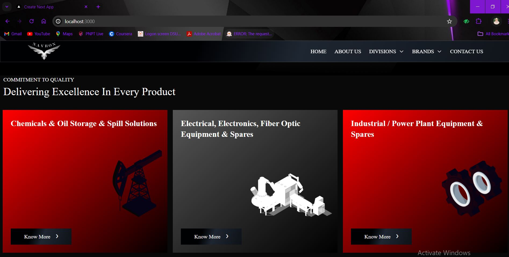

<h1 align="center">Hey, I'm <a href="https://www.linkedin.com/in/hira-fatimaa/" target="_blank">Hira Fatima👋</a></h1>

<h2>About Me</h2> 

  I am <b>Hira Fatima</b>, currently pursuing a <b>Bachelor's Degree in Computer Science</b> at DHA Suffa University, with a focus on <b>AI, cybersecurity, and full-stack development</b>. I’m passionate about coding 💻, solving real-world problems 🌍, and creating innovative tech solutions.

<h2 align="center">AI & Cybersecurity Enthusiast | Full Stack Developer</h2>

  <h2 >Follow & Connect With Me on My Socials!</h>
   
    
  
  
  
  
  

 

  <h2 >🛠 My Tech Stack</h2> 

I'm a **full-stack developer** who loves creating websites and applications with a positive impact. With experience in **Python**, **Java**, **C++**, **HTML**, **CSS**, **JavaScript**, **React.js**, **Node.js**, and **Next.js**, I’m currently diving deeper into **AI** and **cybersecurity** 🔐. 

Some tools I enjoy working with include **Wireshark**, **Metasploit**, and **Nmap**, especially during **Capture the Flag (CTF)** events 🕵️‍♀️.

With over a year of experience, I’ve organized and led **20+ workshops, bootcamps, and tech talks**, focusing on **community building** 🌐 and bridging the gap between academia and practical skills. I also launched the **GDSC@DSU** website to enhance **online presence** and **resource accessibility** for students 🎓.

 

 
<h2 align="center">Languages & Tools</h2>

  
  
  
  
  
  
  
  
  
  
  
  
  
  
  
  

<h1>Projects 💻</h1>
  
<!-- <h1 align="center">Projects</h1> -->
<table bordercolor="#66b2b2" cellpadding="10" cellspacing="0" align="center">

  <tr>
    <td width="50%" valign="top">
      <h3 align="center">☕ Coffee Shop Website</h3>
       
      
       
      

        
        
      

      
Developed this Coffee Shop website as a semester project using HTML, CSS, JavaScript, and Bootstrap. This project highlights advanced front-end skills, focusing on enhancing UI design and user experience.

    </td>
    <td width="50%" valign="top">
      <h3 align="center">🌐 Navron</h3>
       
      
       
      

        
      

      
Designed a user-friendly website for Navron using Figma, focusing on creating visually appealing layouts to enhance user engagement. Utilized Next.js for front-end development and deployment, resulting in a 20% improvement in performance and scalability across various devices.

    </td>
  </tr>

  <tr>
    <td width="50%" valign="top">
      <h3 align="center">💸 Expense Tracker</h3>
       
      
       
      

        
        
      

      
Developed an Expense Tracker application using React, JavaScript, HTML, and CSS. This tool is designed to help users manage their expenses effectively, showcasing advanced front-end development techniques.

    </td>
    <td width="50%" valign="top">
      <h3 align="center">📝 Quiz Web Application</h3>
       
      
       
      

        
        
      

      
Developed a quiz application using React, TypeScript, HTML, and CSS. This project showcases the development of an engaging and intuitive user interface for interactive quizzes, highlighting front-end development skills.

    </td>
  </tr>

  <tr>
    <td width="50%" valign="top">
      <h3 align="center">👟 Shoe Shop Website</h3>
       
      
       
      

        
        
      

      
Built a Shoe Shop website using React, JavaScript, HTML, and CSS. This project demonstrates front-end development skills and creates an engaging user experience for an online shoe store.

    </td>
    <td width="50%" valign="top">
      <h3 align="center">🚑 UN Aid Hub App</h3>
       
      
       
      

        
      

      
The UN Aid Hub app is designed to deliver aid to refugees in cities affected by conflict. It addresses challenges such as access to aid due to damaged infrastructure and coordinates efforts among organizations while providing real-time updates on conflicts.

    </td>
  </tr>

</table>

<h2 align="center" style="color: #A9A9A9;">⚙️ GitHub Analytics</h2>

<table align="center" style="background-color: #2E2E2E;">
  <tr>
    <td></td>
    <td></td>
  </tr>
</table>

  

<!--
**hirafatimaa/hirafatimaa** is a ✨ _special_ ✨ repository because its `README.md` (this file) appears on your GitHub profile.
